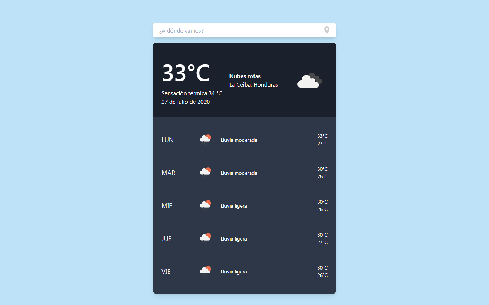
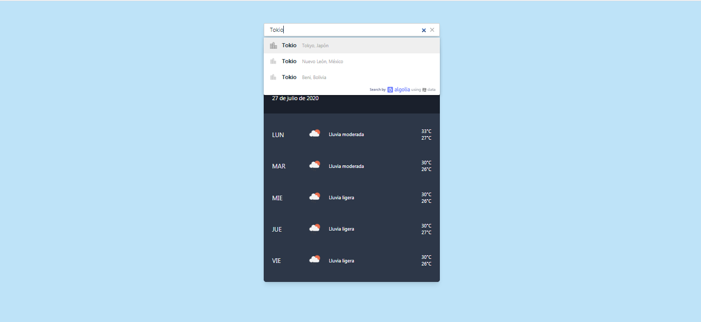

## Vue Weather App

Vue weather app es un pequeno proyecto web desarrollado con las siguientes tecnologias:

- [Laravel 7.21](https://laravel.com/).
- [Vue Js](https://vuejs.org/).
- [Moment Js](https://momentjs.com/).
- [Tailwindcss](https://tailwindcss.com/).
- [Algolia](https://www.algolia.com/).

